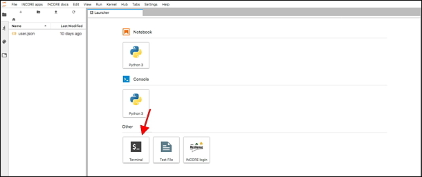
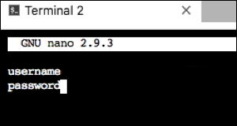
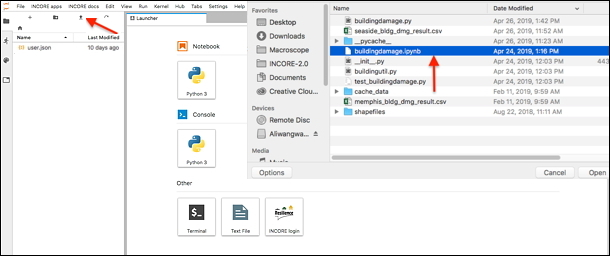
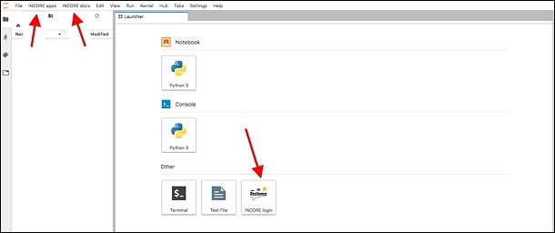
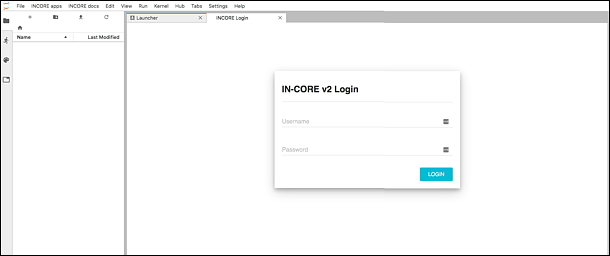
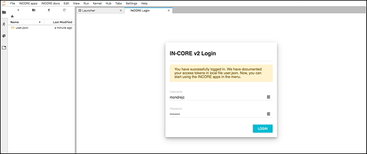
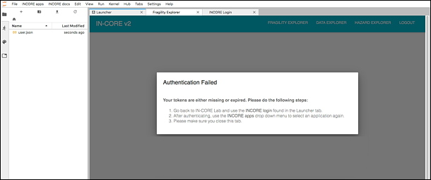
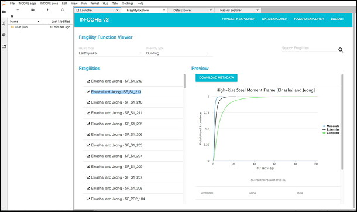

## IN-CORE Lab


A user can run and edit Jupyter Notebooks interactively in NCSA's IN-CORE Lab running at <https://incore-lab.ncsa.illinois.edu>. The IN-CORE Lab is a customized [Jupyter Lab](https://jupyterlab.readthedocs.io/en/stable/#) with **pyIncore** installed on the server running Linux OS.

Login to IN-CORE Lab with your IN-CORE account info.


### Authentication

Create a credential file with IN-CORE username/password (same information you used to login to IN-CORE Lab) in order to use IN-CORE services. This is similar to the local authentication step except the authentication file `.incorepw` is being created on the server:

1. Open the terminal on IN-CORE lab Launcher page (arrow):



2. In the terminal, make sure you are in your HOME directory. Type `pwd` to see the current path and `cd ~` to get into your home directory (`/home/<username>`).

3. Create a hidden (therefore dot prefix) folder using `mkdir .incore` command.



4. Create a hidden credential file in the folder you just created (`cd .incore` followed by `nano .incorepw`) and type IN-CORE username and password using [Nano](https://www.howtogeek.com/howto/42980/the-beginners-guide-to-nano-the-linux-command-line-text-editor/), the Linux command-line text editor. nano text editor. Write your username in the first line and the password in the second.

5. Save the file with `Ctrl+O` and `Enter` commands

6. Close the text editor and return to your shell with `Ctrl+X` command

A chain of terminal commands 2) through 4) above.
```  
    pwd
    cd ~
    ($/home/<username>)
    mkdir .incore
    cd .incore
    nano .incorepw
```
### Running Notebook in the Lab

In [Running Notebook locally](../running.html>) section we described how to run Building damage Notebook locally. 
The following section focuses on **step-by-step instructions** of running Notebooks on the IN-CORE Lab.

1. Create a credential file with IN-CORE username/password if you haven't done it yet. See [IN-CORE Lab](incore_lab.md#IN-CORE Lab) section.

2. Upload the Building Damage Analysis notebook from your local machine to IN-CORE lab by clicking the `Upload` icon in the left panel and select **buildingdamage.ipybn**.



3. The Notebook shows up in the left panel after a successful upload.

4. Double click to open the Notebook in the main area and run it. Instructions on how to run a **Building Damage Analysis**, please refer to previous section [Running Notebook locally](../running.html).


### Accessing IN-CORE Web Tools

This section shows how to access [IN-CORE Web Tools](webt-tools/incore_webtools.html) on IN-CORE Lab. The IN-CORE Lab is a customized Jupyter Lab with `INCORE Login` button in the main window and two IN-CORE-related menus, `INCORE apps` and `INCORE docs`.



1. Click on `INCORE Login` button in the main window. For login use the same username and password.



2. This login process generates a file named **user.json**. It appears in the **File list manager** on the left side. The file contains an authentication token required for development of new analyses using IN-CORE’s Application programming interface ([API](https://en.wikipedia.org/wiki/Application_programming_interface)).




3. Fragility, Data and Hazard Explorers under `INCORE apps` menu become enabled after pressing `LOGIN` button AND reloading the current page in the browser. **NOTE**: A user must reload the whole Jupyter dashboard page (above) using the `Reload` button of the browser, not the Refresh File List (part of Jupyter’s file navigation) otherwise a following Warning appears:



The [IN-CORE Web Tools](../incore_webtools.html) Viewers become part of INCORE Lab as shown below for Fragility viewer.




### IN-CORE documentation

For ease of access - documentation is easily accessible from IN-CORE Lab.

The second IN-CORE menu, `INCORE docs` allows user to see **pyIncore** documentation and API endpoints definitions for accessing Fragility, Data and Hazard server(s).


